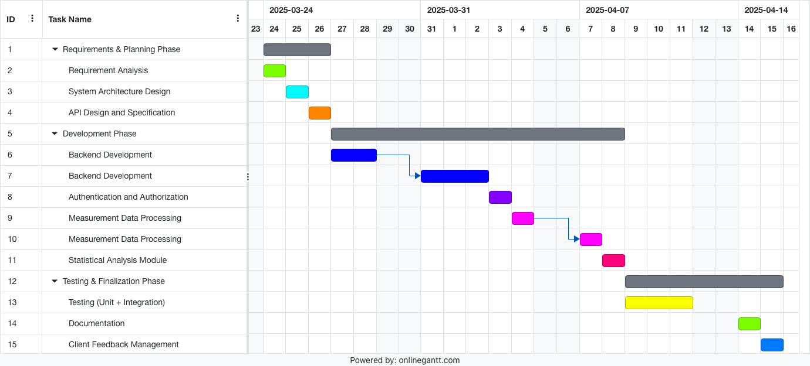

# Project Estimation

Date: 11/04/2025

Version: 1.0

# Estimation approach

Consider the GeoControl project as described in the swagger, assume that you are going to develop the project INDEPENDENT of the deadlines of the course, and from scratch

# Estimate by size

###

|                                                                                                         |  Estimate |
| ------------------------------------------------------------------------------------------------------- | :-------: |
| NC = Estimated number of classes to be developed                                                        |      30   |
| A = Estimated average size per class, in LOC                                                            |     100   |
| S = Estimated size of project, in LOC (= NC \* A)                                                       |    3000   |
| E = Estimated effort, in person hours (here use productivity 10 LOC per person hour)                    |     300   |
| C = Estimated cost, in euro (here use 1 person hour cost = 30 euro)                                     |   9000€   |
| Estimated calendar time, in calendar weeks (Assume team of 4 people, 8 hours per day, 5 days per week ) |  ~2 weeks |

# Estimate by product decomposition

###

| Component Name       | Estimated Effort (person hours) |
| -------------------- | :-----------------------------: |
| Requirement Document |                20               |
| Design Document      |                30               |
| Code                 |               100               |
| Unit Tests           |                30               |
| API Tests            |                40               |
| Management Documents |                20               |
| **Total**            |            240 hours            |

# Estimate by activity decomposition

###

| Activity Name                    | Estimated Effort (person hours) |
| -------------------------------- | :-----------------------------: |
| Requirement Analysis             |                10               |
| System Architecture Design       |                20               |
| API Design and Specification     |                20               |
| Backend Development              |               160               |
| Authentication and Authorization |                30               |
| Measurement Data Processing      |                40               |
| Statistical Analysis Module      |                30               |
| Testing (Unit + Integration)     |                80               |
| Documentation                    |                10               |
| Client Feedback Management       |                10               |
| **Total**                        |             410 hours           |

###

Assuming a team of four people working 8 hours a day, five days a week, this work schedule can be represented in a Gantt chart.

# Summary

Report here the results of the three estimation approaches. The estimates may differ. Discuss here the possible reasons for the difference

|                                    | Estimated effort | Estimated duration |
| ---------------------------------- | :--------------: | :----------------: |
| Estimate by Size                   |    300 hours     |      ~ 2 weeks     |
| Estimate by Product Decomposition  |    240 hours     |      1.5 weeks     |
| Estimate by Activity Decomposition |    410 hours     |      ~ 3 weeks     |

The *size-based estimate* is quick but less precise, focusing on the overall code size.

The *product decomposition estimate* balances detail with effort, assuming well-defined components.

The *activity decomposition estimate* is the most comprehensive but may overestimate non-coding tasks, leading to a longer timeline.