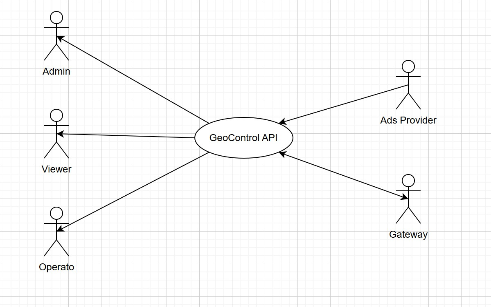
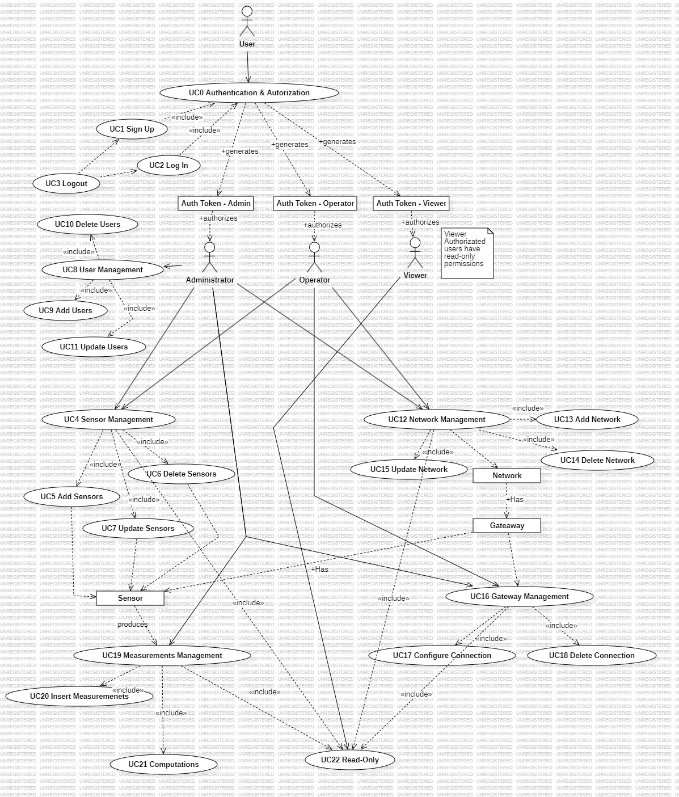
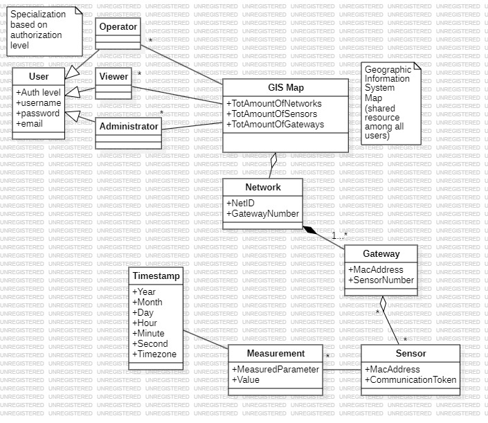
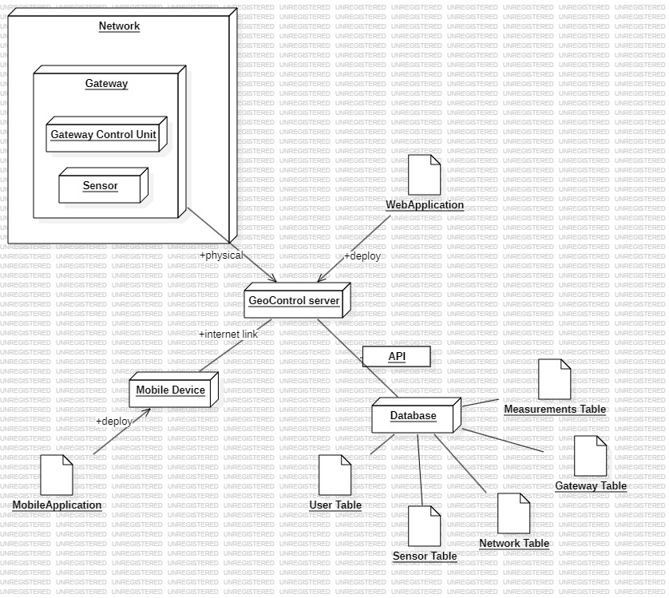

# Requirements Document - GeoControl

Date: 08/04/2025

Version: V1 - description of Geocontrol as described in the swagger
| Version number | Change |
| :------------: | :----: |
|        V1      |        |

# Contents

- [Requirements Document - GeoControl](#requirements-document---geocontrol)
- [Contents](#contents)
- [Informal description](#informal-description)
- [Business model](#business-model)
- [Stakeholders](#stakeholders)
- [Context Diagram and interfaces](#context-diagram-and-interfaces)
  - [Context Diagram](#context-diagram)
  - [Interfaces](#interfaces)
- [Stories and personas](#stories-and-personas)
  - [Personas](#personas)
  - [User Stories](#user-stories)  
- [Functional and non functional requirements](#functional-and-non-functional-requirements)
  - [Functional Requirements](#functional-requirements)
    - [Table of Rights](#table-of-rights)  
  - [Non Functional Requirements](#non-functional-requirements)
- [Use case diagram and use cases](#use-case-diagram-and-use-cases)
  - [Use case diagram](#use-case-diagram)
    - [Use case 0, UC0](#use-case-0-uc0)
    - [Use case 1, UC1](#use-case-1-uc1)
      - [Scenario 1.1](#scenario-11)
    - [Use case 2, UC2](#use-case-2-uc2)
      - [Scenario 2.1](#scenario-21)
      - [Scenario 2.2](#scenario-22)
      - [Scenario 2.3](#scenario-23)
    - [Use case 3, UC3](#use-case-3-uc3)
      - [Scenario 3.1](#scenario-31)
      - [Scenario 3.2](#scenario-32)
    - [Use case 4, UC4](#use-case-4-uc4)
    - [Use case 5, UC5](#use-case-5-uc5)
      - [Scenario 5.1](#scenario-51)
      - [Scenario 5.2](#scenario-52)
    - [Use case 6, UC6](#use-case-6-uc6)
      - [Scenario 6.1](#scenario-61)
      - [Scenario 6.2](#scenario-62)
    - [Use case 7, UC7](#use-case-7-uc7)
      - [Scenario 7.1](#scenario-71)
      - [Scenario 7.2](#scenario-72)
    - [Use case 8, UC8](#use-case-8-uc8)
    - [Use case 9, UC9](#use-case-9-uc9)
      - [Scenario 9.1](#scenario-91)
    - [Use case 10, UC10](#use-case-10-uc10)
      - [Scenario 10.1](#scenario-101)
      - [Scenario 10.2](#scenario-102)
    - [Use case 11, UC11](#use-case-11-uc11)
      - [Scenario 11.1](#scenario-111)
      - [Scenario 11.2](#scenario-112)
    - [Use case 12, UC12](#use-case-12-uc12)
    - [Use case 13, UC13](#use-case-13-uc13)
      - [Scenario 13.1](#scenario-131)
      - [Scenario 13.2](#scenario-132)
    - [Use case 14, UC14](#use-case-14-uc14)
      - [Scenario 14.1](#scenario-141)
      - [Scenario 14.2](#scenario-142)
    - [Use case 15, UC15](#use-case-15-uc15)
      - [Scenario 15.1](#scenario-151)
      - [Scenario 15.2](#scenario-152)
    - [Use case 16, UC16](#use-case-16-uc16)
    - [Use case 17, UC17](#use-case-17-uc17)
      - [Scenario 17.1](#scenario-171)
      - [Scenario 17.2](#scenario-172)
      - [Scenario 17.3](#scenario-173)
      - [Scenario 17.4](#scenario-174)
    - [Use case 18, UC18](#use-case-18-uc18)
      - [Scenario 18.1](#scenario-181)
      - [Scenario 18.2](#scenario-182)
    - [Use case 19, UC19](#use-case-19-uc19)
    - [Use case 20, UC20](#use-case-20-uc20)
    - [Use case 21, UC21](#use-case-21-uc21)
    - [Use case 22, UC22](#use-case-22-uc22)
      - [Scenario 22.1](#scenario-221)
      - [Scenario 22.2](#scenario-222)
      - [Scenario 22.3](#scenario-223)
      - [Scenario 22.4](#scenario-224)

- [Glossary](#glossary)
- [System Design](#system-design)
- [Deployment Diagram](#deployment-diagram)

# Informal description

GeoControl is a software system designed for monitoring physical and environmental variables in various contexts: from hydrogeological analyses of mountain areas to the surveillance of historical buildings, and even the control of internal parameters (such as temperature or lighting) in residential or working environments.

# Business Model
1.	Local Organization-Funded Model 
•	The Union of Mountain Communities in Piedmont funds the system to ensure public safety, environmental monitoring, and infrastructure protection gathering informations from different sensors and networks.
•	Provided as a public service for municipalities, governmental agencies but also for private clients as long as they follow the state’s rules. All the contracts are based on a long term form of contract (licensing).
•	The correct working of the application is ensured through the Gateway, sensors, Region of Piedmont, mantainance staff, Development team and a Customer Support.
• The cost is related to the installation of the sensors and the building of the related structures, the creation of the site, the mantainance staff and the customer service, besides the marketing team.
• Some advetisements can be displayed in the site but they all have to be related somehow to GeoControl (e.g. a sensor manufacturer company, weather forecaster and so on)

# Stakeholders

| Stakeholder name | Description |
| :--------------: | :---------: |
| Product Owner / Manager | Oversees the product vision, roadmap, and ensures value delivery.|
| Development Team | (Engineers, DevOps)  Builds, maintains, and deploys the system.|
|	Marketing Team | Promotes offerings, plus manages ad campaigns.|
|	Customer Support / Technical Support | Handles inquiries and issues across all kind of users.|
|	Data Analysts / Scientists | Work on measurement analysis, anomaly detection, and usage stats|
| Admin | Responsible for managing users and overseeing the entire system. Has full access to all functionalities, including user creation, role assignment, and network topology management.|
| Operator | Manages networks, gateways, and sensors. Can input measurements and perform operational maintenance, but does not manage users|
| Viewer | Has read-only access to data and system topology. Ideal for analysts, researchers, or local administrators who only need to consult measurements and system status|
| End-Users (External Organizations / Clients) | Public or private entities who purchase or adopt the system for monitoring their own physical environments (e.g., building managers, municipalities)|
| Ad Network Providers |	Google AdSense |
| Local IT Firms | Maintenance contracts, on-site support|

# Context Diagram and interfaces

## Context Diagram

\<actors are a subset of stakeholders>

## Interfaces

\<describe here each interface in the context diagram>

| Actor | Logical Interface | Physical Interface |
| :--------------: | :---------: | :---------: |
| Viewer | Web/mobile app and related specific GUIs with limited permissions | PC or smartphones depending on the viewer's location |
| Operator | GUI, but with different permissions with respect to the Admin's GUI | PC |
| Admin | GUI | PC |
| Advertisements| API specifications | Internet |
| Gateway | API request format (e.g., a specific function or action the system supports), Access control rules (e.g., who is allowed to do what) | Network endpoint (e.g., a URL or IP address), Communication protocol (e.g., HTTP, HTTPS, TCP) |

# Stories and personas

\<A Persona is a realistic impersonation of an actor. Define here a few personas and describe in plain text how a persona interacts with the system>

\<Persona is-an-instance-of actor>

\<stories will be formalized later as scenarios in use cases>

### Personas 
##### 1. 	Persona 1: Environmental Scientist
- Age: 37
-	Role: Viewer
-	Goals: Monitor real-time data from multiple sensors in a remote area and analyze environmental changes over time.
-	Pain Points: Difficulty in manually collecting data from remote locations, slow data processing.
-	Needs: Real-time data, historical trends, alerts when thresholds are exceeded.
##### 2.	Persona 2: IT Firm employee
-	Age: 45
-	Role: Operator
-	Goals: Insert the measurements in the applications while checking each sensor works properly.
-	Pain Points: If the sensor stop working he can not insert the measurementsand it has to contact the on-site support.
-	Needs: Real-time alerts, data on sensor efficiency, system integrations for automation.
##### 3.	Persona 3: System Administrator
-	Age: 56
-	Role: Admin
-	Goals: Ensure system uptime, manage user permissions, and troubleshoot technical issues.
-	Pain Points: System overload during peak data collection, security vulnerabilities.
-	Needs: Easy-to-use admin interface, detailed logs, performance monitoring.

### User Stories 
-	As Viewer, I want to be able to view real-time environmental data on a dashboard, so I can monitor conditions continuously.
	Acceptance Criteria:
•	The dashboard should display real-time values for temperature, humidity, pressure, and other relevant data.
•	The dashboard should update dynamically without needing to refresh the page.
-	As a Operator, I want to receive alerts when new measurements when the sensors take new measurements, so I can immediately insert them.
  Acceptance Criteria:	
• The dashboard has to display always the current situations of networks, gateways, sensors.
•	New detections need to be displayed on the operator interface.
-	As an Admin, I want to manage user roles and permissions, so I can control who has access to specific data and features.
	Acceptance Criteria:
•	Admins can create and delete user accounts.
•	Admins can assign roles such as Viewer, Operator and Admin, with different levels of access to the system.

# Functional and non functional requirements

## Functional Requirements

\<In the form DO SOMETHING, or VERB NOUN, describe high level capabilities of the system>

\<they match to high level use cases>

|  ID   | Description |
| :---: | :---------: |
|  FR1  |   	Authentication & Authorization          |
|  FR1.1  |    create new profile by signup          |
|  FR1.2  |    enter profile space by login         |
|  FR1.3  |    exit profile space by logout         |
|  FR1.4  |    give users certain privileges according authorization level via token    |
|  FR2  |     User Management        |
|  FR2.1  |     create new user           |
|  FR2.2  |     delete existing user           |
|  FR2.3  |     change existing user         |
|  FR2.4  |     update existing user privileges        |
|  FR3  |     Sensor Management        |
|  FR3.1  |     add new sensor           |
|  FR3.2  |     create new sensor cluster          |
|  FR3.3  |     delete existing sensor           |
|  FR3.4  |     delete existing sensor cluster          |
|  FR3.5  |     change existing sensor config          |
|  FR3.6  |     change existing sensor cluster config         |
|  FR3.7  |     Measurements Management        |
|  FR3.7.1  |     insert new measurement          |
|  FR3.7.2  |     delete existing measurement           |
|  FR3.7.3  |     change existing measurement         |
|  FR4   |     Network Management        |
|  FR4.1  |     create new network           |
|  FR4.2  |     delete existing network           |
|  FR4.3  |     change existing netwotk config         |
|  FR4.4  |     Gateway Management        |
|  FR4.4.1  |     add new gateway to network           |
|  FR4.4.2  |     delete existing gateway           |
|  FR4.4.3  |     change existing gateway config        |
|  FR5  |      Read        |
|  FR5.1  |   read user data            |
|  FR5.2  |   read sensor data            |
|  FR5.3  |   read measurements data            |
|  FR5.4  |   read network data            |
|  FR5.5  |   read gateway data            |
|  FR6  |      Computations        |
|  FR6.1  |   compute mean (μ)           |
|  FR6.2  |   compute variance (σ²)           |
|  FR6.3  |   compute upper thresholds upperThreshold = μ + 2σ            |
|  FR6.4  |   compute lower thresholds lowerThreshold = μ - 2σ             |
|  FR6.5  |   mark as outlier data lower below lower thresholds             |
|  FR6.6  |   mark as outlier data lower above upper thresholds        |

### Table of Rights
|  ID   | Administrator |  Operator   | Viewer |
| :---: | :---------: | :---------: | :---------: |
|  FR1  |   	Y        | Y   	        | Y  	        |
|  FR1.1  |  Y 	        | Y  	        |Y   	        |
|  FR1.2  |  Y 	        |  Y 	        | Y  	        |
|  FR1.3  |   Y	        | Y  	        |  Y 	        |
|  FR1.4  |   Y	        |  Y 	        |  Y 	        |
|  FR2     |  Y 	        |  N 	        |  N 	        |
|  FR2.1  |  Y 	        |  N 	        |  N 	        |
|  FR2.2  |  Y 	        |  N 	        |  N 	        |
|  FR2.3  |  Y 	        |  N 	        |  N 	        |
|  FR2.4  |  Y 	        |  N 	        |  N 	        |
|  FR3    |   	Y        | Y   	        | N 	        |
|  FR3.1    |   	Y        | Y   	        | N 	        |
|  FR3.2    |   	Y        | Y   	        | N 	        |
|  FR3.3    |   	Y        | Y   	        | N 	        |
|  FR3.4    |   	Y        | Y   	        | N 	        |
|  FR3.5    |   	Y        | Y   	        | N 	        |
|  FR3.6    |   	Y        | Y   	        | N 	        |
|  FR3.7    |   	Y        | Y   	        | N 	        |
|  FR3.7.1    |   	Y        | Y   	        | N 	        |
|  FR3.7.2    |   	Y        | Y   	        | N 	        |
|  FR3.7.3    |   	Y        | Y   	        | N 	        |
|  FR4     |   	Y        | Y   	        | N 	        |
|  FR4.1    |   	Y        | Y   	        | N 	        |
|  FR4.2    |   	Y        | Y   	        | N 	        |
|  FR4.3    |   	Y        | Y   	        | N 	        |
|  FR4.4    |   	Y        | Y   	        | N 	        |
|  FR4.4.1    |   	Y        | Y   	        | N 	        |
|  FR4.4.2    |   	Y        | Y   	        | N 	        |
|  FR4.4.3    |   	Y        | Y   	        | N 	        |
|  FR5  |   	Y        | Y   	        | Y  	        |
|  FR5.1  |   	Y        | Y   	        | Y  	        |
|  FR5.2  |   	Y        | Y   	        | Y  	        |
|  FR5.3  |   	Y        | Y   	        | Y  	        |
|  FR5.4  |   	Y        | Y   	        | Y  	        |
|  FR5.5  |   	Y        | Y   	        | Y  	        |
|  FR6  | N  	        |  N 	        |   	N        |
|  FR6.1  | N  	        |  N 	        |   	N        |
|  FR6.2  | N  	        |  N 	        |   	N        |
|  FR6.3  | N  	        |  N 	        |   	N        |
|  FR6.4  | N  	        |  N 	        |   	N        |
|  FR6.5  | N  	        |  N 	        |   	N        |
|  FR6.6  | N  	        |  N 	        |   	N        |

## Non Functional Requirements

\<Describe constraints on functional requirements>

|   ID    | Type (efficiency, reliability, ..) | Description | 
| :-----: | :--------------------------------: | :---------: |
|  NFR1   |  	Reliability & Availability|  System uptime of 99.995% on one year (almost 2h).  Data loss limited to a maximum of six measurements per sensor per year         |           |
|  NFR2   |     	Security              | 	Token-based authentication.	Encryption for data transmission and storage.          |           |
|  NFR3   |Scalability | 	Support thousands of sensors and multiple networks.	Efficient database indexing for large-scale data retrieval.             |           |
|  NFR4   |     	Performance |	Real-time data processing and alerting.	API response time under 500ms.          |           |
|  NFR5   |         	Compliance & Data Privacy                           |   	GDPR compliance for data handling. Secure user consent management for data collection models.      |           |
|NFR6     |	Usability & Accessibility|Web interface optimized for different screen sizes.Compliance with WCAG accessibility standards.	Time to find the sensor and measurements for a specific measurement <10 min for a user who is a smartphone user >1year. Time to download and deploy <10 min||
|  NFR7   |  	Cost Efficiency   |  	The system should be designed to minimize operational and infrastructure costs while maintaining high performance.	Flexible pricing models to accommodate different user needs. Size of app download <150 Mbytes.	Response time for all functions (except the following) < 0.5 seconds. Login<30sec.        |           |
|  NFR8   |  Safety   |  Ensures data integrity and prevents tampering of sensor readings.	Built-in mechanisms to handle sensor failures and avoid misleading data.	Compliance with safety regulations for critical infrastructure monitoring.        |             |
|  NFR9   |  	Portability   | 	System should be deployable on various cloud and on-premise infrastructures.Compatibility with different sensor types and manufacturers.	Mobile-friendly web interface for access on different devices.        |           |
# Use case diagram and use cases

## Use case diagram

\<define here UML Use case diagram UCD summarizing all use cases, and their relationships>

\<next describe here each use case in the UCD>

|ID| Use Case|
| :--: | :-----------------------:  |
|   UC0   |            Authentication & Autorization               |
|   UC1   |               Sign Up           |
|   UC2   |               Log In            |
|   UC3   |               Logout                |
|   UC4   |            Sensor Management                |
|   UC5   |               Add Sensors                |
|   UC6   |               Delete Sensors                |
|   UC7   |               Update Sensors                |
|   UC8   |            User Management               |
|   UC9   |               Add Users                |
|   UC10   |              Delete Users                 |
|   UC11   |              Update Users                 |
|   UC12   |           Network Management                 |
|   UC13   |              Add Network              |
|   UC14   |              Delete Network              |
|   UC15   |              Update Network              |
|   UC16   |           Gateway Mangement                 |
|   UC17   |              Configure Connection                |
|   UC18   |              Delete Connection              |
|   UC19   |           Measurements Management                 |
|   UC20   |              Insert Measurements                 |
|   UC21   |              Computations                 |
|   UC22   |              Read-Only                 |

### Use case 0, UC1

| Actors Involved  |     User                                                                 |
| :--------------: | :------------------------------------------------------------------: |
|   Precondition   | signup.FORM === TRUE ⊕ login.FORM === TRUE |
|  Post condition  | auth_token === TRUE && GUI(Profile)  |
| Nominal Scenario | Enter the required inputs in the form of your choosing, if no errors during procedure, enter profile space and create user if not defined         |
|     Variants     |                SignUp , Login                      |
|    Exceptions    |                Faulty_Form_Submission                             |

### Use case 1, UC1

| Actors Involved  |         User                                                             |
| :--------------: | :------------------------------------------------------------------: |
|   Precondition   | signup.FORM===TRUE && User_Not_Defined |
|  Post condition  |   auth_token === TRUE && GUI(Profile) && User_Defined   |
| Nominal Scenario |   Input the required data in the signup form , if submission successful enter profile space and define new user         |
|     Variants     |                                            |
|    Exceptions    |                       User_Already_Defined or Faulty_Form_Submission                       |

##### Scenario 1.1

|  Scenario 1.1  |    User_Already_Defined                                                                        |
| :------------: | :------------------------------------------------------------------------: |
|  Precondition  | signup.FORM===TRUE => signup(new_user) => new_user === userDB(record)
| Post condition | new_user === NOT_Allocated && GUI(Sign_Up_View)    |
|     Step#      |                                Description                                 |
|       1        |      Input the data required in the sign up form                                                                      |
|       2        |           Submit the form                                                                 |
|       3       |          User with inputed credentials already present in the database                                                                  |
|       4        |      System throws error User_Already_Defined, reject form submission                                                                      |
|       5        |          Return to sign up form                                                               |

##### Scenario 1.2

|  Scenario 1.2  |   Faulty_Form_Submission                                                                      |
| :------------: | :------------------------------------------------------------------------: |
|  Precondition  | signup.FORM===FALSE 
| Post condition | new_user === NOT_Allocated && GUI(Sign_Up_View)    |
|     Step#      |                                Description                                 |
|       1        |      Input the data required in the sign up form                                                                      |
|       2        |           Submit the form                                                                 |
|       3       |          User inputed data not inside form regulations                                                                  |
|       4        |      System throws error Faulty_Form_Submission, reject form submission                                                                      |
|       5        |          Return to sign up form                                                               |

### Use case 2, UC2

| Actors Involved  |        User                                                              |
| :--------------: | :------------------------------------------------------------------: |
|   Precondition   | User_Already_Defined && login.FORM===TRUE  |
|  Post condition  |  auth_token === TRUE && GUI(Profile_View)    |
| Nominal Scenario |      Input the required data in the login form , if submission successful enter profile space             |
|     Variants     |   Incorrect_Username_Input or Incorrect_Password_Input or Forgot_Password                                       |
|    Exceptions    |                       User_Not_Defined                 |

##### Scenario 2.1

|  Scenario 2.1  |   Incorrect_Username_Input                                                                       |
| :------------: | :------------------------------------------------------------------------: |
|  Precondition  | User_Already_Defined && login.FORM===TRUE && username !=NULL && password !=NULL |
| Post condition |  login().error === TRUE && GUI(Log_In_View)   |
|     Step#      |                                Description                                 |
|       1        |      Input the data required in the log in form                                                                      |
|       2        |           Submit the form                                                                 |
|       3        |          User with inputed username either doesnt exist in the database or wrong credential combination                                                                  |
|       4        |      System throws error, reject form submission                                                                      |
|       5        |          Return to log in form                                                               |

##### Scenario 2.2

|  Scenario 2.2  |    Incorrect_Password_Input                                                                         |
| :------------: | :------------------------------------------------------------------------: |
|  Precondition  | User_Already_Defined && login.FORM===TRUE && username !=NULL && password !=NULL |
| Post condition |  login().error === TRUE && GUI(Log_In_View)   |
|     Step#      |                                Description                                 |
|       1        |      Input the data required in the log in form                                                                      |
|       2        |           Submit the form                                                                 |
|       3        |          User with inputed password either doesnt exist in the database or wrong credential combination                                                                  |
|       4        |      System throws error, reject form submission                                                                      |
|       5        |          Return to log in form                                                               |

##### Scenario 2.3

|  Scenario 2.3  |   Forgot_Password                                                                      |
| :------------: | :------------------------------------------------------------------------: |
|  Precondition  | User_Already_Defined && login.FORM.forgot_pass===TRUE && username !=NULL |
| Post condition |  old_password != new_password && GUI(Log_In_View)   |
|     Step#      |                                Description                                 |
|       1        |      Input the username in the log in form                                                                      |
|       2        |           Choose the "Forgot Password" option                                                               |
|       3        |          Client redirects into a authentication checker                                                                  |
|       4        |     Checker requires security backup inputs                                                                     |
|       5        |          Successful backup requires password reset                                                                 |
|       6        |          Set new password                                                                 |
|       7        |         Return to log in form                                                                 |

##### Scenario 2.4

|  Scenario 2.4  |   User_Not_Defined                                                                      |
| :------------: | :------------------------------------------------------------------------: |
|  Precondition  | GUI(Log_In_View) && login.FORM===TRUE
| Post condition | GUI(Log_In_View) &&     |
|     Step#      |                                Description                                 |
|       1        |         Input the username and password in the log in form                                                                      |
|       2        |         Systems checks database, user not present                                                              |
|       3       |         System throws error User_Not_Defined                                                              |
|       4       |         Return to log in form                                                                 |

### Use case 3, UC3

| Actors Involved  |         User                                                             |
| :--------------: | :------------------------------------------------------------------: |
|   Precondition   |  auth_token === TRUE && GUI(Profile)  | 
|  Post condition  |  auth_token === expired && GUI(Landing Page)   |
| Nominal Scenario |  Select the Log Out function and return to the Landing Page, globaly expiring auth_token |
|     Variants     |                                          |
|    Exceptions    |     Session_Timeout or Token_Still_Valid                       |

##### Scenario 3.1

|  Scenario 3.1  |    Session_Timeout                                                                         |
| :------------: | :------------------------------------------------------------------------: |
|  Precondition  | auth_token === TRUE && GUI(Profile) |
| Post condition | auth_token === FALSE && GUI(Landing_Page_View)   |
|     Step#      |                                Description                                 |
|       1        |      Client automatically logs out the user due to extended period of inactivity                               |
|       2        |      Returns to Landing_Page_View                                                                      |

##### Scenario 3.2

|  Scenario 3.2  |    Token_Still_Valid                                                                         |
| :------------: | :------------------------------------------------------------------------: |
|  Precondition  | auth_token === TRUE && GUI(Profile) |
| Post condition | auth_token === FALSE && GUI(Landing_Page_View)   |
|     Step#      |                                Description                                 |
|       1        |      Returns to Landing_Page_View                                 |
|       2        |      Authentication token still valid even after user log out              |

### Use case 4, UC4

| Actors Involved  |    Administrator , Operator                                                                   |
| :--------------: | :--------------------------------------------------------------------------------------------------------------------------: |
|   Precondition   | (auth_token.authorization === Admin or auth_token.authorization === Operator) && auth_token===valid  |
|  Post condition  |    |
| Nominal Scenario |         This set of use cases is only possible with Administrator and Operator authorization          |
|     Variants     |                                          |
|    Exceptions    |                                              |

### Use case 5, UC5

| Actors Involved  |     Administrator , Operator                                                                  |
| :--------------: | :-----------------------------------------------------------------------------: |
|   Precondition   | (auth_token.authorization === Admin or auth_token.authorization === Operator) && add(new_sensor) && auth_token===valid|
|  Post condition  |  sensor_count++   |
| Nominal Scenario |       Add a new sensor in the sensor cluster          |
|     Variants     |                                            |
|    Exceptions    |       Physical_Device_Not_Present or Duplicate_Sensor                      |

##### Scenario 5.1

|  Scenario 5.1  |   Physical_Device_Not_Present                                                                         |
| :------------: | :------------------------------------------------------------------------: |
|  Precondition  | GUI(Sensor_Control_View) && add(new_sensor) |
| Post condition |  new_sensor===NULL    |
|     Step#      |                                Description                                 |
|       1        |        Input the required data to insert a new sensor in the cluster                                                                    |
|       2        |        System cannot recognize the physical interface related to configurations and specifics inputed                                   |
|       3        |        Physical Device not present                                                                    |
|       4        |        System throws error Physical Device not present , reject form submission                                                                    |
|       5        |        Return to Sensor_Control_View                                                                    |

##### Scenario 5.2

|  Scenario 5.2  |   Duplicate_Sensor                                                                         |
| :------------: | :------------------------------------------------------------------------: |
|  Precondition  | GUI(Sensor_Control_View) && add(new_sensor) |
| Post condition |  new_sensor===NULL    |
|     Step#      |                                Description                                 |
|       1        |        Input the required data to insert a new sensor in the cluster                                                                    |
|       2        |        System already recognizes the physical interface related to configurations and specifics inputed                                   |
|       3        |        Sensor already present in the database                                                                  |
|       4        |        System throws error Duplicate_Sensor, reject form submission                                                                    |
|       5        |        Return to Sensor_Control_View                                                                    |

### Use case 6, UC6

| Actors Involved  |     Administrator , Operator                                                                  |
| :--------------: | :-----------------------------------------------------------------------------: |
|   Precondition   | (auth_token.authorization === Admin or auth_token.authorization === Operator) && delete(chosen_sensor) && auth_token===valid|
|  Post condition  |  sensor_count-- && chosen_sensor===NULL   |
| Nominal Scenario |       Delete a sensor in the sensor cluster          |
|     Variants     |      Sensor_Cluster_Empty                                        |
|    Exceptions    |                                      |

##### Scenario 6.1

|  Scenario 6.1  |    Sensor_Cluster_Empty                                                                        |
| :------------: | :------------------------------------------------------------------------: |
|  Precondition  | GUI(Sensor_Control_View)  &&  sensor_count==0  |
| Post condition |    |
|     Step#      |                                Description                                 |
|       1        |        Sensor database empty                                  |
|       2        |        System throws error Sensor_Cluster_Empty , cannot invoke delete<sensor>()                                                                     |

### Use case 7, UC7

| Actors Involved  |     Administrator , Operator                                                                  |
| :--------------: | :-----------------------------------------------------------------------------: |
|   Precondition   | (auth_token.authorization === Admin or auth_token.authorization === Operator) && put(chosen_sensor) && auth_token===valid|
|  Post condition  |  sensor_count.changes === FALSE && chosen_sensor.changes===TRUE   |
| Nominal Scenario |       Update chosen sensor configuration or values in chosen cluster          |
|     Variants     |     Sensor_Cluster_Empty                                  |
|    Exceptions    |     Bad_Request                         |

##### Scenario 7.1

|  Scenario 7.1  |    Bad_Request                                                                         |
| :------------: | :------------------------------------------------------------------------: |
|  Precondition  | GUI(Sensor_Control_View) && put(chosen_sensor) |
| Post condition |  chosen_sensor===NULL     |
|     Step#      |                                Description                                 |
|       1        |        Give prompt to change chosen sensor's attributes                                                                   |
|       2        |        System cannot recognize the sensor related to configurations and specifics inputed , wrong inputs                                  |
|       3        |        System throws error Bad_Request , reject update function                                                                    |
|       4        |        Return to Sensor_Control_View                                                                    |

##### Scenario 7.2

|  Scenario 7.2  |    Sensor_Cluster_Empty                                                                        |
| :------------: | :------------------------------------------------------------------------: |
|  Precondition  | GUI(Sensor_Control_View)  &&  sensor_count==0  |
| Post condition |    |
|     Step#      |                                Description                                 |
|       1        |        Sensor database empty                                  |
|       2        |        System throws error Sensor_Cluster_Empty , cannot invoke put<sensor>()                                                                     |

### Use case 8, UC8

| Actors Involved  |   Administrator                                                                      |
| :--------------: | :------------------------------------------------------------------: |
|   Precondition   | auth_token.authorization === Admin && auth_token===valid|
|  Post condition  |     |
| Nominal Scenario |  This set of use cases is only possible with Administrator authorization       |
|     Variants     |                                            |
|    Exceptions    |                                               |

### Use case 9, UC9

| Actors Involved  |   Administrator                                                                      |
| :--------------: | :------------------------------------------------------------------: |
|   Precondition   | auth_token.authorization === Admin  && add(new_user,authorization_level) && auth_token===valid|
|  Post condition  |  user_count++    |
| Nominal Scenario |  Add a new user with chosen authorization level and specifics to be determined by the user performing the operation      |
|     Variants     |                                            |
|    Exceptions    |  User_Already_Defined   or Faulty_Form_Submission                     |

##### Scenario 9.1

|  Scenario 9.1  |    User_Already_Defined                                                                        |
| :------------: | :------------------------------------------------------------------------: |
|  Precondition  | GUI(User_Control_View) && add(new_user,authorization_level)
| Post condition | new_user === NOT_Allocated && GUI(User_Control_View) && user.count.changes===FALSE   |
|     Step#      |                                Description                                 |
|       1        |      Input the data required in the add new user form                                                                      |
|       2        |           Submit the form                                                                 |
|       3       |          User with inputed credentials already present in the database                                                                  |
|       4        |      System throws error, reject form submission                                                                      |
|       5        |          Return to User_Control_View                                                               |

##### Scenario 9.2

|  Scenario 9.2  |   Faulty_Form_Submission                                                                      |
| :------------: | :------------------------------------------------------------------------: |
|  Precondition  | sGUI(User_Control_View) && add(new_user,authorization_level) 
| Post condition | new_user === NOT_Allocated && GUI(User_Control_View) && user.count.changes===FALSE    |
|     Step#      |                                Description                                 |
|       1        |      Input the data required in the add user function form                                                                      |
|       2        |           Submit the form                                                                 |
|       3       |          User inputed data not inside form regulations                                                                  |
|       4        |      System throws error Faulty_Form_Submission, reject form submission                                                                      |
|       5        |          Return to User_Control_View                                                              |

### Use case 10, UC10

| Actors Involved  |   Administrator                                                                      |
| :--------------: | :------------------------------------------------------------------: |
|   Precondition   | auth_token.authorization === Admin && delete(chosen_user) && auth_token===valid|
|  Post condition  |  user_count-- && chosen_user===NULL    |
| Nominal Scenario |  Delete a user from user database along with its privileges   |
|     Variants     |  User_Cluster_Empty                                         |
|    Exceptions    |                      |

##### Scenario 10.1

|  Scenario 10.1  |    User_Cluster_Empty                                                                        |
| :------------: | :------------------------------------------------------------------------: |
|  Precondition  | GUI(User_Control_View) &&  user_count==0  |
| Post condition |    |
|     Step#      |                                Description                                 |
|       1        |        User database empty                                  |
|       2        |        System throws error User_Cluster_Empty , cannot invoke delete<user>()                                                                     |

### Use case 11, UC11

| Actors Involved  |   Administrator                                                                      |
| :--------------: | :------------------------------------------------------------------: |
|   Precondition   | auth_token.authorization === Admin  && put(chosen_user) && auth_token===valid|
|  Post condition  | user_count.changes === FALSE && chosen_user.changes===TRUE    |
| Nominal Scenario |  Update chosen user attributes from user database    |
|     Variants     |   User_Cluster_Empty                                        |
|    Exceptions    |   Bad_Request                        |

##### Scenario 11.1

|  Scenario 11.1  |    User_Cluster_Empty                                                                        |
| :------------: | :------------------------------------------------------------------------: |
|  Precondition  | GUI(User_Control_View) &&  user_count==0  |
| Post condition |  chosen_user===NULL   |
|     Step#      |                                Description                                 |
|       1        |        User database empty                                  |
|       2        |        System throws error User_Cluster_Empty , cannot invoke put<user>()                                                                     |

##### Scenario 11.2

|  Scenario 11.2  |    Bad_Request                                                                        |
| :------------: | :------------------------------------------------------------------------: |
|  Precondition  | GUI(User_Control_View) && put(chosen_user) |
| Post condition |  chosen_user===NULL     |
|     Step#      |                                Description                                 |
|       1        |        Give prompt to change chosen users's attributes                                                                   |
|       2        |        Inputed data are not compliant with user data regulation                                  |
|       3        |        System throws error Bad_Request , reject update function                                                                     |
|       4        |        Return to User_Control_View                                                                    |

### Use case 12, UC12

| Actors Involved  |   Administrator , Operator                                                                     |
| :--------------: | :------------------------------------------------------------------: |
|   Precondition   | (auth_token.authorization === Admin or auth_token.authorization === Operator) && auth_token===valid|
|  Post condition  |     |
| Nominal Scenario |  This set of use cases is only possible with Administrator and Operator authorization       |
|     Variants     |                                            |
|    Exceptions    |                                                |

### Use case 13, UC13

| Actors Involved  |   Administrator , Operator                                                                     |
| :--------------: | :------------------------------------------------------------------: |
|   Precondition   | (auth_token.authorization === Admin or auth_token.authorization === Operator) && add(new_network) && auth_token===valid|
|  Post condition  |  network_count++    |
| Nominal Scenario |  Add a new network schema with chosen configuration and specifics, to be determined by the user performing the operation      |
|     Variants     |                                             |
|    Exceptions    | Network_Already_Defined                        |

##### Scenario 13.1

|  Scenario 13.1  |   Network_Already_Defined                                                                         |
| :------------: | :------------------------------------------------------------------------: |
|  Precondition  | GUI(Network_Control_View) && add(new_network) |
| Post condition |  new_network===NULL    |
|     Step#      |                                Description                                 |
|       1        |        Input the required data to insert a new network in the cluster                                                                    |
|       2        |        System already recognizes the physical interface related to configurations and specifics inputed                                   |
|       3        |        Network already present in the database                                                                  |
|       4        |        System throws error Network_Already_Defined, reject form submission                                                                    |
|       5        |        Return to Network_Control_View                                                                    |

### Use case 14, UC14

| Actors Involved  |   Administrator , Operator                                                                     |
| :--------------: | :------------------------------------------------------------------: |
|   Precondition   | (auth_token.authorization === Admin or auth_token.authorization === Operator) && delete(chosen_network) && auth_token===valid|
|  Post condition  |  network_count-- && chosen_network===NULL    |
| Nominal Scenario |  Delete a network from network database along with its prior configurations   |
|     Variants     |   Network_Database_Empty                                         |
|    Exceptions    |                           |

##### Scenario 14.1

|  Scenario 14.1  |    Network_Database_Empty                                                                         |
| :------------: | :------------------------------------------------------------------------: |
|  Precondition  | GUI(Network_Control_View) && network_count==0
| Post condition |    |
|     Step#      |                                Description                                 |
|       1        |        Network database empty                                  |
|       2        |        System throws error Network_Database_Empty , cannot invoke delete<network>()                                                                     |

### Use case 15, UC15

| Actors Involved  |   Administrator , Operator                                                                     |
| :--------------: | :------------------------------------------------------------------: |
|   Precondition   | (auth_token.authorization === Admin or auth_token.authorization === Operator) && put(chosen_network) && auth_token===valid|
|  Post condition  | network_count.changes === FALSE && chosen_network.changes===TRUE    |
| Nominal Scenario |  Update chosen network attributes and configurations    |
|     Variants     |   Network_Database_Empty                                         |
|    Exceptions    |   Bad_Request                        |

##### Scenario 15.1

|  Scenario 15.1  |    Bad_Request                                                                         |
| :------------: | :------------------------------------------------------------------------: |
|  Precondition  | GUI(Network_Control_View) && put(chosen_network)
| Post condition | chosen_network.changes=== FALSE && GUI(Network_Control_View) && network.count.changes===FALSE    |
|     Step#      |                                Description                                 |
|       1        |        Give prompt to change chosen networks's attributes                                                                   |
|       2        |        System cannot recognize the networks related to configurations and specifics inputed , wrong inputs                                  |
|       3        |        System throws error Bad_Request , reject update function                                                                    |
|       4        |        Return to Network_Control_View                                                               |

##### Scenario 15.2

|  Scenario 15.2  |    Network_Database_Empty                                                                         |
| :------------: | :------------------------------------------------------------------------: |
|  Precondition  | GUI(Network_Control_View) && network_count==0
| Post condition |    |
|     Step#      |                                Description                                 |
|       1        |        Network database empty                                  |
|       2        |        System throws error Network_Database_Empty , cannot invoke put<network>()                                                                     |

### Use case 16, UC16

| Actors Involved  |    Administrator , Operator                                                                   |
| :--------------: | :--------------------------------------------------------------------------------------------------------------------------: |
|   Precondition   | (auth_token.authorization === Admin or auth_token.authorization === Operator) && auth_token===valid  |
|  Post condition  |    |
| Nominal Scenario |         This set of use cases is only possible with Administrator and Operator authorization          |
|     Variants     |                                          |
|    Exceptions    |                                              |

### Use case 17, UC17

| Actors Involved  |    Administrator , Operator                                                                   |
| :--------------: | :--------------------------------------------------------------------------------------------------------------------------: |
|   Precondition   | (auth_token.authorization === Admin or auth_token.authorization === Operator) && auth_token===valid && put(chosen_gateway) |
|  Post condition  | gateway_count.changes === FALSE && chosen_gateway.changes===TRUE    |
| Nominal Scenario |  Update chosen gateway attributes and configurations    |
|     Variants     |   Gateway_Database_Empty  or Network_Database_Empty                                       |
|    Exceptions    |  Physical_Device_Undefined  or Bad_Request                        |

##### Scenario 17.1

|  Scenario 17.1  |    Bad_Request                                                                         |
| :------------: | :------------------------------------------------------------------------: |
|  Precondition  | GUI(Gateway_Control_View) && put(chosen_gateway)
| Post condition | chosen_gateway.changes === FALSE && GUI(Gateway_Control_View) && gateway.count.changes === FALSE    |
|     Step#      |                                Description                                 |
|       1        |        Give prompt to change chosen gateway's attributes                                                                   |
|       2        |        System cannot recognize the gateway's configurations and specifics inputed , wrong inputs                                  |
|       3        |        System throws error Bad_Request , reject update function                                                                    |
|       4        |        Return to Gateway_Control_View                                                               |

##### Scenario 17.2

|  Scenario 17.2  |    Network_Database_Empty                                                                         |
| :------------: | :------------------------------------------------------------------------: |
|  Precondition  | GUI(Gateway_Control_View) && network_count==0 |
| Post condition |    |
|     Step#      |                                Description                                 |
|       1        |        Network database empty                                  |
|       2        |        System throws error Network_Database_Empty , cannot invoke put<gateway>() as there is no host network |

##### Scenario 17.3

|  Scenario 17.3  |    Physical_Gateway_Undefined                                                                         |
| :------------: | :------------------------------------------------------------------------: |
|  Precondition  | GUI(Gateway_Control_View) && add(new_gateway) |
| Post condition |  new_gateway===NULL    |
|     Step#      |                                Description                                 |
|       1        |        Input the required data to insert a gateway in the cluster                                                                    |
|       2        |        System cannot recognize the physical interface related to configurations and specifics inputed                                   |
|       3        |        Physical Device not present                                                                    |
|       4        |        System throws error Physical Device not present , reject form submission                                                                    |
|       5        |        Return to Gateway_Control_View                                                                    |

##### Scenario 17.4

|  Scenario 17.4  |    Gateway_Database_Empty                                                                         |
| :------------: | :------------------------------------------------------------------------: |
|  Precondition  | GUI(Gateway_Control_View) && network_count==0
| Post condition |    |
|     Step#      |                                Description                                 |
|       1        |        Gateway database empty                                  |
|       2        |        System throws error Gateway_Database_Empty , cannot invoke put<gateway>()                                                                     |

### Use case 18, UC18

| Actors Involved  |    Administrator , Operator                                                                   |
| :--------------: | :--------------------------------------------------------------------------------------------------------------------------: |
|   Precondition   | (auth_token.authorization === Admin or auth_token.authorization === Operator) && auth_token===valid && delete(chosen_gateway) |
|  Post condition  | gateway_count--     |
| Nominal Scenario |  Delete chosen gateway along with attributes and configurations    |
|     Variants     |   Gateway_Database_Empty or Network_Database_Empty                                        |
|    Exceptions    |                           |

##### Scenario 18.1

|  Scenario 18.1  |    Gateway_Database_Empty                                                                         |
| :------------: | :------------------------------------------------------------------------: |
|  Precondition  | GUI(Gateway_Control_View) && gateway_count==0
| Post condition |    |
|     Step#      |                                Description                                 |
|       1        |        Gateway database empty                                  |
|       2        |        System throws error Gateway_Database_Empty , cannot invoke delete<gateway>()     |

##### Scenario 18.2

|  Scenario 18.2  |    Network_Database_Empty                                                                         |
| :------------: | :------------------------------------------------------------------------: |
|  Precondition  | GUI(Gateway_Control_View) && network_count==0 |
| Post condition |    |
|     Step#      |                                Description                                 |
|       1        |        Network database empty                                  |
|       2        |        System throws error Network_Database_Empty , cannot invoke delete<gateway>() as there is no host network |

### Use case 19, UC19

| Actors Involved  |    Administrator , Operator                                                                   |
| :--------------: | :--------------------------------------------------------------------------------------------------------------------------: |
|   Precondition   | (auth_token.authorization === Admin or auth_token.authorization === Operator) && auth_token===valid  |
|  Post condition  |    |
| Nominal Scenario |         This set of use cases is only possible with Administrator and Operator authorization          |
|     Variants     |                                          |
|    Exceptions    |                                              |

### Use case 20, UC20

| Actors Involved  |    Administrator , Operator                                                                   |
| :--------------: | :--------------------------------------------------------------------------------------------------------------------------: |
|   Precondition   | (auth_token.authorization === Admin or auth_token.authorization === Operator) && auth_token===valid && insert(new_measurement) |
|  Post condition  | measurement_count--     |
| Nominal Scenario |  Add new measurement along with attributes     |
|     Variants     |                                            |
|    Exceptions    |                            |

### Use case 21, UC21

| Actors Involved  |      --System Functionality--(No actor action required)                                                              |
| :--------------: | :--------------------------------------------------------------------------------------------------------------------------: |
|   Precondition   | |
|  Post condition  | measurement.value => {system.computes()}     |
| Nominal Scenario | System functionaly that computes certain values by using measurements     |
|     Variants     |                                            |
|    Exceptions    |                            |

### Use case 22, UC22

| Actors Involved  |    Administrator , Operator , Viewer                                                                  |
| :--------------: | :--------------------------------------------------------------------------------------------------------------------------: |
|   Precondition   |  auth_token===valid  |
|  Post condition  |     |
| Nominal Scenario |  Read values of the allowed models and their existing records, Only allowed functionality of the Viewer     |
|     Variants     |   Gateway_Database_Empty  or Network_Database_Empty  or Sensor_Cluster_Empty or Measurements_Database_Empty                                           |
|    Exceptions    |                            |

##### Scenario 22.1

|  Scenario 22.1  |    Gateway_Database_Empty                                                                         |
| :------------: | :------------------------------------------------------------------------: |
|  Precondition  | GUI(User_View) && gateway_count==0
| Post condition |    |
|     Step#      |                                Description                                 |
|       1        |        Gateway database empty , cannot read data                                |

##### Scenario 22.2

|  Scenario 22.2  |    Network_Database_Empty                                                                         |
| :------------: | :------------------------------------------------------------------------: |
|  Precondition  | GUI(User_View) && network_count==0 |
| Post condition |    |
|     Step#      |                                Description                                 |
|       1        |        Network database empty , cannot read data                                |

##### Scenario 22.3

|  Scenario 22.3  |    Sensor_Cluster_Empty                                                                        |
| :------------: | :------------------------------------------------------------------------: |
|  Precondition  | GUI(User_View)  &&  sensor_count==0  |
| Post condition |    |
|     Step#      |                                Description                                 |
|       1        |        Sensor database empty , cannot read data                                |

##### Scenario 22.4

|  Scenario 22.4  |    Gateway_Measurements_Database_Empty                                                                        |
| :------------: | :------------------------------------------------------------------------: |
|  Precondition  | GUI(User_View) && measurements_count==0
| Post condition |    |
|     Step#      |                                Description                                 |
|       1        |        Measurements database empty , cannot read data                                |

# Glossary
1.  User: Generic role of a person who is currently using the system, different permissions classified by authorization levels
2.  Viewer: Basic level authorization user, read-only privileges
3.  Operator: 2nd-level authorization user, write and read privileges over all records except the user records.
4.  Administrator: Full authorization user, write and read privileges over all records.
5.  Sensor: A device that measures environmental or structural variables (e.g., temperature, humidity, inclination).
6.  Gateway: A physical device that collects data from sensors and transmits it to the GeoControl system.
7.  Network: A logical grouping of gateways and sensors representing a monitored area.
8.	Measurement: A numerical value recorded by a sensor at a specific timestamp.
9.	Timestamp: The date and time a measurement was recorded, stored in UTC format.
10.	Anomaly Detection: The identification of measurements that deviate significantly from statistical thresholds.
11.	Thresholds: Predefined upper and lower limits used to identify anomalies in collected data.
12.	Dashboard: A user interface displaying real-time monitoring data and analytics.
13.	Alert: A notification triggered when a measurement exceeds defined thresholds.
14.	API: A set of endpoints that allow external applications to interact with the GeoControl system.
15.	Firmware Update: Software updates applied to gateways and sensors to improve functionality or security.
16.	Role-Based Access Control (RBAC): A system that restricts access based on user roles (Admin, Operator, Viewer).
17.	Encryption: Security mechanism ensuring safe transmission and storage of sensitive data.
18.	GIS (Geographic Information System): A tool for mapping and analyzing sensor data based on geolocation.

\<use UML class diagram to define important terms, or concepts in the domain of the application, and their relationships>

\<concepts must be used consistently all over the document, ex in use cases, requirements etc>

# System Design

\<describe here system design>

\<must be consistent with Context diagram>

Geo-Control is composed of:
  - Hardware components : 
    - Sensors(Sensor + MCU)
    - Gateway(CPU/MCU embedded)
    - Server Side (System Host)
  - Software components :
    - Application Program Interface (Authentication logic, Database connectivity, Data and Device control logic)
    - Clients:
      - Web Application
      - Mobile Application 

1. User Authentication and Role Management
  Actors: Admin, Operator, Viewer
  Description: A user logs in with credentials, receives a token, and gains access to functionalities based on their role.
  Main Flow:
    1.	User enters credentials (username, password).
    2.	System validates credentials and issues an authentication token.
    3.	User can access functionalities according to their role.
  Alternative Flow (Invalid Credentials):
    1.	System denies access and returns an error message.

2. Adding a New Sensor to a Gateway
  Actors: Operator, Admin
  Description: A user adds a new sensor to an existing gateway.
  Main Flow:
    1.	User selects a gateway and chooses “Add Sensor.”
    2.	User enters the sensor’s MAC address and metadata.
    3.	System validates and registers the sensor.
  Alternative Flow (Invalid MAC Address):
    1.	System rejects the request and displays an error message.

3. Collecting and Storing Measurements
  Actors: Gateway, Sensor, System
  Description: Sensors send periodic measurements to their associated gateway, which forwards them to the system.
  Main Flow:
    1.	Sensor measures data (e.g., temperature, inclination).
    2.	Gateway receives data, converts it, and sends it to the system.
    3.	System stores the measurement with a timestamp in UTC format.
  Alternative Flow (Data Loss):
    1.	If data is lost, the system logs an error but continues processing.

4. Detecting Anomalous Values (Outliers)
  Actors: System
  Description: The system analyzes stored measurements to detect outliers.
  Main Flow:
    1.	System retrieves measurements within a time range.
    2.	Computes mean (μ) and variance (σ²).
    3.	Calculates thresholds:
      -	upperThreshold = μ + 2σ
      - lowerThreshold = μ - 2σ
    4.	Flags measurements exceeding these thresholds as anomalies.

5. Viewing Reports and Historical Data
  Actors: Viewer, Operator, Admin
  Description: A user retrieves stored measurements for analysis.
  Main Flow:
    1.	User selects a time range and parameters (e.g., temperature).
    2.	System retrieves and displays data in graphs/tables.

# Deployment Diagram

\<describe here deployment diagram >

The deployment diagram of the GeoControl system illustrates the physical and logical arrangement of its hardware and software components. At the base level, the system operates within multiple network structure each composed of a gateway and sensors. Each sensor, measures physical parameters and transmits data to its associated gateway. The gateway, containing a control unit, performs data preprocessing and forwards the measurements to the central GeoControl server over a network connection.

The GeoControl server forms the core of the system, hosting essential software artifacts such as the API and the Web Application. These modules manage user authentication, device control, data collection, and analytical operations. Connected to the server is a database that stores structured data across several tables—specifically for users, networks, gateways, sensors, and sensor measurements.

Clients interact with the server via two main interfaces: a web application accessed through browsers, and IDEALLY a mobile application  installed on mobile devices . Both client types communicate securely over the internet using the server’s exposed API. 

