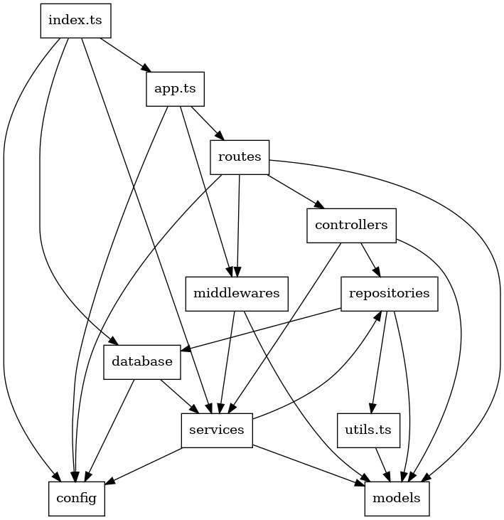
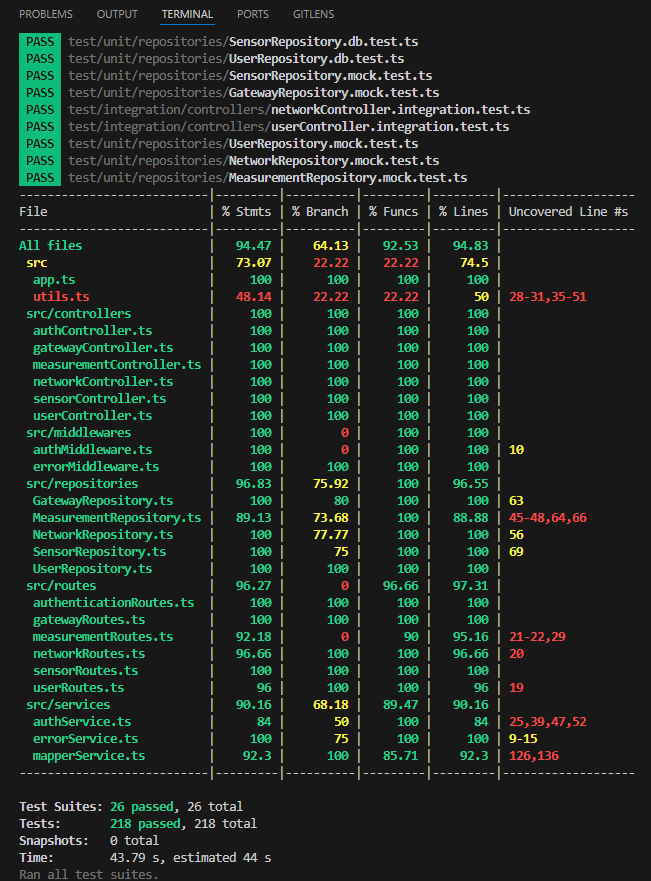

# Test Report
This report covers the integration testing performed on the entirety of the GeoControl system, focusing on the different user types' interaction with the system, sensor-generated measurements across the hierarchical structure of network, gateway, and sensor.

# Table of Contents
- [Test Report](#test-report)
- [Contents](#contents)
- [Dependency graph](#dependency-graph)
- [Integration approach](#integration-approach)
- [Tests](#tests)
- [Coverage of Functional Requirements (FR) and Scenarios](#coverage-of-functional-requirements-fr-and-scenarios)
- [White-Box Coverage](#white-box-coverage)

# Dependency graph
<table>
  <tr>
    <td align="center">
      
       
      <em>Figure 4 – Dependency graph for the project, grouped by top-level folders.</em>
    </td>
  </tr>
</table>

The diagram highlights:
- **Controllers → Services → Repositories:** the call flow follows an MVC pattern, preventing direct coupling between the presentation layer and data-access layer.
- **Central services** (the “services” node) act as a hub—these are the hotspots to watch for potential bottlenecks and cyclic dependencies.
- **Database & Config** are isolated in their own nodes, making future data-persistence migrations or refactors simpler.

# Integration approach
We adopted a mixed integration testing strategy combining **bottom-up** and **top-down** approaches to ensure comprehensive test coverage.

**<Entity_Name>** = `[network, gateway, sensor, user, measurement]` + `authentication` (routes only)

## Unit Testing Phase (Bottom-up)
    
### Repository Layer
Unit tests for the repository layer are structured into two sections for each model:

1. **Database Operation Tests** (`.db.test.ts`): These tests validate core database operations using mocked data, ensuring that each repository correctly interacts with the database.

2. **Repository Logic Tests** (`.mock.test.ts`): These tests isolate and verify the repository logic using mocked dependencies, without requiring actual database interaction.

**Test File Location**: `/test/unit/repositories`

|               File Name                |                Purpose                 |
|----------------------------------------|----------------------------------------|
| `<Entity_Name>Repository.db.test.ts`   |   Validates database CRUD operations   |
| `<Entity_Name>Repository.mock.test.ts` |   Tests repository logic with mocks    |

---

### Controller Layer
Integration tests for controllers follow a consistent strategy focused on verifying the interaction between the controller logic and its dependencies (repositories, mappers, and services).

Key aspects of this strategy include:

- **Mocked Dependencies**:  
  Repositories are mocked to isolate the controller logic, ensuring tests validate only the controller's behavior without relying on external systems like databases.

- **Data Transformation Validation**:
  Tests verify that controllers properly transform DAO (Data Access Object) models into DTOs (Data Transfer Objects), removing sensitive or unnecessary fields.

- **Error Handling**:  
  Test edge cases (like `NotFoundError`) to confirm robust error propagation and handling.

- **Business Logic Coverage**:  
  For `measurementController`, tests validate statistical calculations (mean, variance), date filtering, and aggregation of measurements across sensors or networks.

This approach ensures controllers integrate correctly with their dependencies while maintaining clean data boundaries and robust error handling.

**Test File Location**: `/test/integration/controllers`

|                   File Name                   |                       Purpose                          |
|-----------------------------------------------|--------------------------------------------------------|
| `<Entity_Name>Controller.integration.test.ts` | Validates controller business logic and error handling |

---

### Route Layer (Top-Down)
This phase follows a comprehensive integration testing strategy that focuses on verifying the behavior of API endpoints for each model using `supertest` to simulate HTTP requests:

- Covers all standard HTTP methods (`GET`, `POST`, `PATCH`, `DELETE`)
- Validates both success and error scenarios (status codes, validation errors, etc.)
- Tests authentication, authorization and input validation
- Verifies request/response payload formats according to Swagger documentation

**Test File Location**: `/test/integration/routes`

|                 File Name                 |                                   Purpose                                          |
|-------------------------------------------|------------------------------------------------------------------------------------|
| `<Entity_Name>Routes.integration.test.ts` | Validates API route logic and request/response formatting using mocked controllers |

---

### End-to-End Testing (System Integration)
The End-to-End (E2E) tests follow a structured strategy to validate the complete flow of API requests, from authentication to database persistence, while ensuring correct authorization and robust error handling.

- Verifies data persistence
- Confirms authorization enforcement
- Ensures correct propagation of errors across layers

**Test File Location**: `/test/e2e/<Entity_Name>s`

|           File Name         |                           Purpose                              |
|-----------------------------|----------------------------------------------------------------|
| `<Entity_Name>.e2e.test.ts` | Validates full stack flow from API to DB using real components |

---

### Cross-Component Integration
Cross-model integration is inherently tested due to hierarchical relationships and cascading dependencies among entities.

Verified interactions between:

- `Measurement ↔ Sensor, Gateway, Network`
- `Sensor ↔ Gateway, Network`
- `Gateway ↔ Network`
- `User roles ↔ Measurement, Sensor, Gateway, Network` (for role-based access control)

**Key Aspects Tested**:

- Cascade operations
- Data integrity across relationships
- Hierarchical consistency during create/update/delete operations

# Tests
<in the table below list the test cases defined For each test report the object tested, the test level (API, integration, unit) and the technique used to define the test case (BB/ eq partitioning, BB/ boundary, WB/ statement coverage, etc)> <split the table if needed>

## Gateway API Test Cases
| Test case name | Object(s) tested | Test level | Technique used |
| :------------: | :--------------: | :--------: | :------------: |
| Create Gateway Admin | Gateway API POST /gateways | API | BB / Equivalence Partitioning |
| Reject Duplicate MAC | Gateway API POST /gateways | API | BB / Boundary |
| List All Gateways in Network | Gateway API GET /gateways | API | BB / Equivalence Partitioning |
| Gateway Access Roles | Gateway API GET /gateways | API | BB / Equivalence Partitioning |
| Get Specific Gateway | Gateway API GET /gateways/:mac | API | BB / Equivalence Partitioning |
| Gateway Not Found | Gateway API GET /gateways/:mac | API | BB / Boundary |
| Update Gateway | Gateway API PATCH /gateways/:mac | API | WB / Statement Coverage |
| Delete Gateway | Gateway API DELETE /gateways/:mac | API | WB / Statement Coverage |

## Measurement API Test Cases
| Test case name | Object(s) tested | Test level | Technique used |
| :------------: | :--------------: | :--------: | :------------: |
| Create Measurement Admin & Operator | Measurement API POST /measurements | API | BB / Equivalence Partitioning |
| Block Viewer from Creating Measurement | Measurement API POST /measurements | API | BB / Boundary |
| Measurement on Non existent Sensor | Measurement API POST /measurements | API | BB / Boundary |
| Get Sensor Measurements | Measurement API GET /measurements | API | BB / Equivalence Partitioning |
| Measurements Access Roles | Measurement API GET /measurements | API | BB / Equivalence Partitioning |
| Get Network Measurements | Measurement API GET /networks/:code/measurements | API | WB / Statement Coverage |
| Get Network Stats | Stats API GET /networks/:code/stats | API | WB / Statement Coverage |
| Get Network Outliers | Outlier API GET /networks/:code/outliers | API | BB / Equivalence Partitioning |
| Get Sensor Stats | Stats API GET /sensors/:mac/stats | API | WB / Statement Coverage |
| Get Sensor Outliers | Outlier API GET /sensors/:mac/outliers | API | BB / Equivalence Partitioning |

## Network API Test Cases
| Test case name | Object(s) tested | Test level | Technique used |
| :------------: | :--------------: | :--------: | :------------: |
| Create Network Admin | Network API POST /networks | API | BB / Equivalence Partitioning |
| Reject Duplicate Network Code | Network API POST /networks | API | BB / Boundary |
| List All Networks | Network API GET /networks | API | BB / Equivalence Partitioning |
| Networks Access Roles | Network API GET /networks | API | BB / Equivalence Partitioning |
| Get Specific Network | Network API GET /networks/:code | API | BB / Equivalence Partitioning |
| Non Existent Network | Network API GET /networks/:code | API | BB / Boundary |
| Admin Update Network | Network API PATCH /networks/:code | API | WB / Statement Coverage |
| Admin Delete Network | Network API DELETE /networks/:code | API | WB / Statement Coverage |

## Sensor API Test Cases
| Test case name | Object(s) tested | Test level | Technique used |
| :------------: | :--------------: | :--------: | :------------: |
| Admin Create Sensor | Sensor API POST /networks/:networkCode/gateways/:gatewayMac/sensors | API | BB / Equivalence Partitioning |
| List Gateway Sensors | Sensor API GET /networks/:networkCode/gateways/:gatewayMac/sensors | API | BB / Equivalence Partitioning |
| Sensor Access Roles | Sensor API GET /networks/:networkCode/gateways/:gatewayMac/sensors | API | BB / Equivalence Partitioning |
| Get Specific Sensor | Sensor API GET /networks/:networkCode/gateways/:gatewayMac/sensors/:sensorMac | API | BB / Equivalence Partitioning |
| Non Existent Sensor | Sensor API GET /networks/:networkCode/gateways/:gatewayMac/sensors/:sensorMac | API | BB / Boundary |
| Admin Update Sensor | Sensor API PATCH /networks/:networkCode/gateways/:gatewayMac/sensors/:sensorMac | API | WB / Statement Coverage |
| Admin Delete Sensor | Sensor API DELETE /networks/:networkCode/gateways/:gatewayMac/sensors/:sensorMac | API | WB / Statement Coverage |

## User API Test Cases
| Test case name | Object(s) tested | Test level | Technique used |
| :------------: | :--------------: | :--------: | :------------: |
| List All Users | User API GET /users | API | BB / Equivalence Partitioning |
| Create User | User API POST /users | API | BB / Equivalence Partitioning |
| Get Specific User | User API GET /users/:id | API | BB / Equivalence Partitioning |
| Delete User | User API DELETE /users/:id | API | WB / Statement Coverage |
| Prevent User Creation by Non Admin | User API POST /users | API | BB / Boundary |

## Controllers Tests
| Test case name | Object(s) tested | Test level | Technique used |
| :------------: | :--------------: | :--------: | :------------: |
| Get Gateway - mapperService integration              | GatewayController.getGateway                  | Integration | BB / Output Validation     |
| Get Measurements By Sensor - stats    | MeasurementController.getAllMeasurementsBySensor | Integration | BB / Equivalence Partitioning |
| Get Measurements By Network - aggregation            | MeasurementController.getAllMeasurementsByNetwork | Integration | BB / Equivalence Partitioning |
| Filter Measurements By Date                          | MeasurementController.getAllMeasurementsBySensor | Integration | BB / Boundary          |
| Sensor Not Found - throws NotFoundError              | MeasurementController.getAllMeasurementsBySensor | Integration | BB / Error          |
| Get Network - removes empty fields                   | NetworkController.getNetwork                  | Integration | BB / Output Validation     |
| Get Sensor - removes empty fields                    | SensorController.getSensorByMac               | Integration | BB / Output Validation     |
| Get User - mapper service integration | userController.getUser |Integration |WB / Statement coverage|

## Auth Tests
| Test case name | Object(s) tested | Test level | Technique used |
| :------------: | :--------------: | :--------: | :------------: |
| Auth - success returns token                                     | POST /api/v1/auth                              | Integration | BB / Equivalence Partitioning |
| Auth - 400 missing username                                      | POST /api/v1/auth                              | Integration | BB / Boundary Value        |
| Auth - 401 unauthorized invalid password                         | POST /api/v1/auth                              | Integration | BB / Error        |
| Auth - 404 user not found                                        | POST /api/v1/auth                              | Integration | BB / Error        |

## Gateways Tests
| Test case name | Object(s) tested | Test level | Technique used |
| :------------: | :--------------: | :--------: | :------------: |
| Get all gateways - success                                       | GET /api/v1/networks/:networkCode/gateways     | Integration | BB / Output Validation     |
| Get all gateways - 401 missing or invalid token                  | GET /api/v1/networks/:networkCode/gateways     | Integration | BB / Error Guessing        |
| Get all gateways - 404 not found                                 | GET /api/v1/networks/:networkCode/gateways     | Integration | BB / Error         |
| Create gateway - success                                         | POST /api/v1/networks/:networkCode/gateways    | Integration | BB / Equivalence Partitioning |
| Create gateway - 400 bad request                                 | POST /api/v1/networks/:networkCode/gateways    | Integration | BB / Boundary       |
| Create gateway - 401 unauthorized                                | POST /api/v1/networks/:networkCode/gateways    | Integration | BB / Error Guessing        |
| Create gateway - 403 forbidden                                   | POST /api/v1/networks/:networkCode/gateways    | Integration | BB / Error Guessing        |
| Create gateway - 404 not found                                   | POST /api/v1/networks/:networkCode/gateways    | Integration | BB / Error Guessing        |
| Create gateway - 409 conflict                                    | POST /api/v1/networks/:networkCode/gateways    | Integration | BB / Error Guessing        |
| Get gateway by MAC - success                                     | GET /api/v1/networks/:networkCode/gateways/:mac| Integration | BB / Output Validation     |
| Get gateway by MAC - 401 unauthorized                            | GET /api/v1/networks/:networkCode/gateways/:mac| Integration | BB / Error Guessing        |
| Get gateway by MAC - 404 not found                               | GET /api/v1/networks/:networkCode/gateways/:mac| Integration | BB / Error Guessing        |
| Update gateway - 204 success                                     | PATCH /api/v1/networks/:networkCode/gateways/:mac | Integration | BB / Equivalence Partitioning |
| Update gateway - 400 bad input                                   | PATCH /api/v1/networks/:networkCode/gateways/:mac | Integration | BB / Boundary Value        |
| Update gateway - 401 unauthorized                                | PATCH /api/v1/networks/:networkCode/gateways/:mac | Integration | BB / Error Guessing        |
| Update gateway - 403 forbidden                                   | PATCH /api/v1/networks/:networkCode/gateways/:mac | Integration | BB / Error Guessing        |
| Update gateway - 404 not found                                   | PATCH /api/v1/networks/:networkCode/gateways/:mac | Integration | BB / Error Guessing        |
| Update gateway - 409 conflict                                    | PATCH /api/v1/networks/:networkCode/gateways/:mac | Integration | BB / Error Guessing        |
| Delete gateway - 204 success                                     | DELETE /api/v1/networks/:networkCode/gateways/:mac | Integration | BB / Equivalence Partitioning |
| Delete gateway - 401 unauthorized                                | DELETE /api/v1/networks/:networkCode/gateways/:mac | Integration | BB / Error Guessing        |
| Delete gateway - 403 forbidden                                   | DELETE /api/v1/networks/:networkCode/gateways/:mac | Integration | BB / Error Guessing        |
| Delete gateway - 404 not found                                   | DELETE /api/v1/networks/:networkCode/gateways/:mac | Integration | BB / Error Guessing        |

## Measurements and Stats Tests
| Test case name | Object(s) tested | Test level | Technique used |
| :------------: | :--------------: | :--------: | :------------: |
| 200: returns all measurements                                  | Network Measurements                | Integration| BB / Equivalent Partitioning                     |
| 400: Invalid Input Data (network measurements)                 | Query Params Validation             | Integration| BB / Boundary                    |
| 401: UnauthorizedError (network measurements)                  | AuthService                         | Integration| BB / EP                     |
| 404: Network NotFoundError (network measurements)              | MeasurementController Error Handling| Integration| BB / Equivalent Partitioning                     |
| 200: returns all statistics                                    | Network Stats                       | Integration| BB / Equivalent Partitioning                     |
| 400: Invalid Input Data (network stats)                        | Query Params Validation             | Integration| BB / Boundary                    |
| 401: UnauthorizedError (network stats)                         | AuthService                         | Integration| BB / EP                     |
| 404: Network NotFoundError (network stats)                     | MeasurementController Error Handling| Integration| BB / EP                     |
| 200: returns all outlier measurements                          | Network Outliers                    | Integration| BB / Equivalent Partitioning                     |
| 400: Invalid Input Data (network outliers)                     | Query Params Validation             | Integration| BB / Boundary VA                    |
| 401: UnauthorizedError (network outliers)                      | AuthService                         | Integration| BB / Equivalent Partitioning                     |
| 404: Network NotFoundError (network outliers)                  | MeasurementController Error Handling| Integration| BB / Equivalent Partitioning                     |
| 201: measurement created                                       | Create Measurement                  | Integration| BB / Equivalent Partitioning                     |
| 400: Invalid Input Data (create measurement)                   | Request Body Validation             | Integration| BB / Boundary VA                    |
| 401: UnauthorizedError (create measurement)                    | AuthService                         | Integration| BB / Equivalent Partition                     |
| 403: InsufficientRightsError (create measurement)              | AuthService Role Checking           | Integration| BB / Equivalent Partition                     |
| 404: NotFoundError (create measurement)                        | MeasurementController Error Handling| Integration| BB / Equivalent Partition                     |
| 200: returns measurements (sensor level)                       | Sensor Measurements                 | Integration| BB / Equivalent Partition                     |
| 400: Invalid Input Data (sensor measurements)                  | Query Params Validation             | Integration| BB / Boundary VA                    |
| 401: UnauthorizedError (sensor measurements)                   | AuthService                         | Integration| BB / Equivalent Partition                     |
| 404: NotFoundError (sensor measurements)                       | MeasurementController Error Handling| Integration| BB / Equivalent Partition                     |
| 200: returns statistics (sensor level)                         | Sensor Stats                        | Integration| BB / Equivalent Partition                     |
| 400: Invalid Input Data (sensor stats)                         | Query Params Validation             | Integration| BB / Boundary VA                    |
| 401: UnauthorizedError (sensor stats)                          | AuthService                         | Integration| BB / Equivalent Partition                     |
| 404: NotFoundError (sensor stats)                              | MeasurementController Error Handling| Integration| BB / Equivalent Partition                     |
| 200: returns outlier measurements (sensor level)               | Sensor Outliers                     | Integration| BB / Equivalent Partition                     |
| 400: Invalid Input Data (sensor outliers)                      | Query Params Validation             | Integration| BB / Boundary VA                    |
| 401: UnauthorizedError (sensor outliers)                       | AuthService                         | Integration| BB / Equivalent Partition                     |
| 404: NotFoundError (sensor outliers)                           | MeasurementController Error Handling| Integration| BB / Equivalent Partition                     |

## Network Tests
| Test case name | Object(s) tested | Test level | Technique used |
| :------------: | :--------------: | :--------: | :------------: |
| get all networks: 200                               | GET /api/v1/networks              | Integration      | BB / Equivalent Partition |
| get all networks: 401 UnauthorizedError             | Token validation       | Integration      | BB / Error Guessing        |
| create network: 201                                 | /networks              | Integration      | BB / Equivalence Partition |
| create network: 400 BadRequestError                 | Network request body   | Integration      | BB / Boundary Value        |
| create network: 401 UnauthorizedError              | Token validation       | Integration      | BB / Error Guessing        |
| create network: 403 InsufficientRightsError         | Authorization          | Integration      | BB / Error Guessing        |
| create network: 409 ConflictError                   | Network duplication    | Integration      | BB / Equivalence Partition |
| get network: 200                                    | /networks/:code        | Integration      | BB / Equivalence Partition |
| get network: 401 UnauthorizedError                 | Token validation       | Integration      | BB / Error Guessing        |
| get network: 404 NotFoundError                      | Invalid network code   | Integration      | BB / Equivalence Partition |
| network updated: 204                                | PATCH /networks/:code  | Integration      | BB / Equivalence Partition |
| network updated: 400 Invalid Input Data             | PATCH body             | Integration      | BB / Boundary Value        |
| network updated: 401 UnauthorizedError             | Token validation       | Integration      | BB / Error Guessing        |
| network updated: 403 InsufficientRightsError        | Authorization          | Integration      | BB / Error Guessing        |
| network updated: 404 NotFoundError                  | Invalid network code   | Integration      | BB / Equivalence Partition |
| network updated: 409 ConflictError                  | Data conflict          | Integration      | BB / Equivalence Partition |
| network deleted: 204                                | DELETE /networks/:code | Integration      | BB / Equivalence Partition |
| network deleted: 401 UnauthorizedError             | Token validation       | Integration      | BB / Error Guessing        |
| network deleted: 403 InsufficientRightsError        | Authorization          | Integration      | BB / Error Guessing        |
| network deleted: 404 NotFoundError                  | Invalid network code   | Integration      | BB / Equivalence Partition |

## Sensors Tests
| Test case name | Object(s) tested | Test level | Technique used |
| :------------: | :--------------: | :--------: | :------------: |
| get all sensors: 200                                | /sensors               | Integration      | BB / Equivalence Partition |
| get all sensors: 401 UnauthorizedError             | Token validation       | Integration      | BB / Error Guessing        |
| get all sensors: 404 NotFoundError                  | Invalid gateway path   | Integration      | BB / Equivalence Partition |
| create sensor: 201                                  | POST /sensors          | Integration      | BB / Equivalence Partition |
| create sensor: 400 Invalid body                     | Sensor request body    | Integration      | BB / Boundary Value        |
| create sensor: 401 UnauthorizedError               | Token validation       | Integration      | BB / Error Guessing        |
| create sensor: 403 InsufficientRightsError          | Authorization          | Integration      | BB / Error Guessing        |
| create sensor: 404 NotFoundError                    | Invalid gateway        | Integration      | BB / Equivalence Partition |
| create sensor: 409 ConflictError                    | Duplicate MAC          | Integration      | BB / Equivalence Partition |
| get a sensor: 200                                   | GET /sensors/:mac      | Integration      | BB / Equivalence Partition |
| get a sensor: 401 UnauthorizedError                | Token validation       | Integration      | BB / Error Guessing        |
| get a sensor: 404 NotFoundError                     | Invalid MAC            | Integration      | BB / Equivalence Partition |
| update a sensor: 204                                | PATCH /sensors/:mac    | Integration      | BB / Equivalence Partition |
| update a sensor: 400 invalid input                  | PATCH body             | Integration      | BB / Boundary Value        |
| update a sensor: 401 UnauthorizedError             | Token validation       | Integration      | BB / Error Guessing        |
| update a sensor: 403 InsufficientRightsError        | Authorization          | Integration      | BB / Error Guessing        |
| update a sensor: 404 NotFoundError                  | Invalid MAC            | Integration      | BB / Equivalence Partition |

## User API Integration Tests
| Test case name | Object(s) tested | Test level | Technique used |
| :------------: | :--------------: | :--------: | :------------: |
| get all users: 200                              | GET /api/v1/users                   | Integration  | BB / Equivalence Partitioning |
| get all users: 401 UnauthorizedError            | GET /api/v1/users                   | Integration  | BB / Error Guessing       |
| get all users: 403 InsufficientRightsError      | GET /api/v1/users                   | Integration  | BB / Error Guessing       |
| create new user: 201                            | POST /api/v1/users                  | Integration | BB / Equivalence Partitioning |
| create new user: 400 BadRequestError            | POST /api/v1/users                  | Integration   | BB / Input Validation     |
| create new user: 401 UnauthorizedError          | POST /api/v1/users                  | Integration   | BB / Error Guessing       |
| create new user: 403 InsufficientRightsError    | POST /api/v1/users                  | Integration   | BB / Error Guessing       |
| create new user: 409 ConflictError              | POST /api/v1/users                  | Integration   | BB / Boundary Testing     |
| get user from userName: 200                     | GET /api/v1/users/:username         | Integration   | BB / Equivalence Partitioning |
| get user from userName: 401 UnauthorizedError   | GET /api/v1/users/:username         | Integration   | BB / Error Guessing       |
| get user from userName: 403 InsufficientRightsError | GET /api/v1/users/:username     | Integration   | BB / Error Guessing       |
| get user from userName: 404 NotFoundError       | GET /api/v1/users/:username         | Integration   | BB / Error Guessing       |
| delete user: 204                                | DELETE /api/v1/users/:username      | Integration   | BB / Equivalence Partitioning |
| delete user: 401 UnauthorizedError              | DELETE /api/v1/users/:username      | Integration   | BB / Error Guessing       |
| delete user: 403 InsufficientRightsError        | DELETE /api/v1/users/:username      | Integration   | BB / Error Guessing       |
| delete user: 404 NotFoundError                  | DELETE /api/v1/users/:username      | Integration   | BB / Error Guessing       |

## Gateway Unit Tests
| Test case name | Object(s) tested | Test level | Technique used |
| :------------: | :--------------: | :--------: | :------------: |
| create gateway                                     | createGateway                             | Unit  | WB / Statement Coverage |
| get gateways by network                            | getGatewaysByNetwork                      | Unit  | WB / Statement Coverage |
| find gateway by mac: not found                     | getGatewayByMac                           | Unit  | BB / Error Guessing       |
| create gateway: conflict                           | createGateway                             | Unit  | BB /  Error Guessing   |
| update gateway without changing mac                | updateGateway                              | Unit  | WB /  Statement Coverage     |
| update gateway with new mac                        | updateGateway                              | Unit | WB / Statement Coverage      |
| delete gateway                                     | deleteGateway                              | Unit  | WB / Statement Coverage |
| delete gateway with sensors - should cascade       | deleteGateway + cascade delete on sensors | Unit  | BB / Error Guessing      |
| create gateway (mocked)                            | createGateway (mocked)                     | Unit         | WB / Statement Coverage   |
| create gateway: conflict (mocked)                  | createGateway (mocked)                     | Unit         | BB / Error Guessing       |
| get gateway by mac (mocked)                        | getGatewayByMac (mocked)                   | Unit         | WB / Statement Coverage   |
| get gateway by mac: not found (mocked)             | getGatewayByMac (mocked)                   | Unit         | BB / Error Guessing       |
| delete gateway (mocked)                            | deleteGateway (mocked)                     | Unit         | WB / Statement Coverage   |

## Measurement Repository Unit Tests
| Test case name | Object(s) tested | Test level | Technique used |
| :------------: | :--------------: | :--------: | :------------: |
| create measurement                                        | MeasurementRepository       | Unit | WB / Statement Coverage |
| get all measurements by sensor with date range            | MeasurementRepository       | Unit | BB / Boundary |
| get all measurements by network with sensor filter        | MeasurementRepository       | Unit | WB / Statement Coverage |
| get all measurements by network without sensor filter     | MeasurementRepository       | Unit | BB / Equivalence Partitioning |
| calculate correct statistics                              | MeasurementRepository       | Unit | BB / Error Guessing |
| detect outliers correctly                                 | MeasurementRepository       | Unit | BB / Error Guessing |
| throw NotFoundError for non-existent sensor               | MeasurementRepository       | Integration Test | BB / Equvialence Partitioning |
| silently skip non-existent sensors in network fetch       | MeasurementRepository       | Unit | BB / Equivalence Partitioning |
| MeasurementRepository: mocked database                    | MeasurementRepository       | Unit        | WB / Statement Coverage |
| create measurement                                        | MeasurementRepository       | Unit        | WB / Statement Coverage |
| create measurement: sensor not found                      | MeasurementRepository       | Unit        | WB / Exception Testing |
| get measurements by sensor                                | MeasurementRepository       | Unit        | WB / Statement Coverage |
| get measurements by network                               | MeasurementRepository       | Unit        | WB / Statement Coverage |

## Network Unit Tests
| Test case name | Object(s) tested | Test level | Technique used |
| :------------: | :--------------: | :--------: | :------------: |
| create network                  | createNetwork()             | Unit  | BB / Equivalence Partitioning              |
| create network:conflict | createNetwork() | Unit | BB / Equivalence Partiton |
| get network by code                              | getNetworkByCode()            | Unit  | BB / Equivalence Partitioning              |
| get network by code: not found               | getNetworkByCode()          | Unit  | BB / Equivalence Partitioning                        |
| deleteNetwork | deleteNetwork() | Unit | WB / Statement Coverage |
| create network (mocked)                       | createNetwork()             | Unit         | Equivalent Partition                    |
| create network: conflict (mocked)             | createNetwork()             | Unit         | BB / Equivalent Partition                       |
| get network by code (mocked)                  | getNetworkByCode()          | Unit         | BB / equivalent Partition                    |
| get network by code: not found (mocked)       | getNetworkByCode()          | Unit         | BB / Equivalent Partition                        |
| delete network (mocked)                       | deleteNetwork()             | Unit         | WB / Statement Coverage                    |

## Sensor Unit Tests
| Test case name | Object(s) tested | Test level | Technique used |
| :------------: | :--------------: | :--------: | :------------: |
| create sensor                                          | createSensor()              | Unit  | BB / Equivalence Partitioning              |
| get sensors by gateway                                 | getSensorsByGateway()       | Unit  | BB / Equivalence Partitioning              |
| find sensor by mac: not found                          | getSensorByMac()            | Unit  | BB / Error Guessing                        |
| create sensor: conflict                                | createSensor()              | Unit  | BB / Equivalence Partitioning + Error Guessing |
| update sensor without changing mac                     | updateSensor()              | Unit  | WB / Statement Coverage                      |
| update sensor with new mac                             | updateSensor()   | Unit  | WB / Statement Coverage     |
| delete sensor                                          | deleteSensor()              | Unit  | WB / Statement Coverage              |
| delete sensor with measurements - should cascade       | deleteSensor(), cascading   | Unit  | BB / Cascade Deletion                      |
| create sensor (mocked)                                 | createSensor()              | Unit         | BB / Equivalent Partition                    |
| create sensor: conflict (mocked)                       | createSensor()              | Unit         | BB / Equivalent Partition                       |
| get sensor by mac (mocked)                             | getSensorByMac()            | Unit         | BB / Equivalent Partition                    |
| get sensor by mac: not found (mocked)                  | getSensorByMac()            | Unit         | WB - Error Guessing                        |
| delete sensor (mocked)                                 | deleteSensor()              | Unit         | WB - Statement Coverage                    |

## User Repository Tests
| Test case name | Object(s) tested | Test level | Technique used |
| :------------: | :--------------: | :--------: | :------------: |
| create user                          | createUser()             | Unit  | WB / Statement Coverage              |
| find user by username: not found     | getUserByUsername()      | Integration  | BB - Equivalent Partition                        |
| create user: conflict                | createUser()             | Integration  | BB / Equivalent Partition |
| create user (mocked)                 | createUser()             | Unit         | WB / Statement Coverage                    |
| create user: conflict (mocked)       | createUser()             | Unit         | BB / Equivalent Partition                       |
| find user by username (mocked)       | getUserByUsername()      | Unit         | WB / Statement Coverage                    |
| find user by username: not found     | getUserByUsername()      | Unit         | BB / Equivalent Partition                        |
| delete user (mocked)                 | deleteUser()             | Unit         | WB / Statement Coverage                    |

# Coverage of Functional Requirements (FR) and Scenarios

## Users

| Functional Requirement or Scenario | Test(s) |
| :--------------------------------: | :-----: |
| FR2.1 Retrieve all users | get all users :200 (userRoutes.integration.test.ts), 401 UnauthorizedError, 403 InsufficientRightsError (userRoutes.integration.test.ts) |
| FR2.2 Create a new user | create user (UserRepository.db.test, UserRepository.mock.test), create new user: 201, 400, 401, 403, 409 (userRoutes.integration.test.ts), POST /users - create new user (users.e2e.test), prevent non-admin creating users (users.e2e.test) |
| FR2.3 Retrieve a specific user | find user by username: not found (UserRepository.db.test, UserRepository.mock.test), get user by username: 200, 401, 403, 404 (userRoutes.integration.test) |
| FR2.4 Delete a specific user | delete user (UserRepository.mock.test), delete user: 204, 403, 404 (userRoutes.integration.test) |
| Scenario: create user | create user (UserRepository.db.test, mock), create new user: 201, 400, 401, 403, 409 (userRoutes.integration.test), e2e tests for creation and permissions |
| Scenario: create user with invalid username | create user: conflict (UserRepository.db.test, mock), 409 ConflictError (userRoutes.integration.test) |
| Scenario: find user by username | find user by username (UserRepository.mock.test), get user: 200 (userRoutes.integration.test) |
| Scenario: find user by username not found | find user: not found (UserRepository.db.test, mock), 404 NotFoundError (userRoutes.integration.test) |
| Scenario: delete user | delete user (UserRepository.mock.test), delete user: 204 (userRoutes.integration.test) |
| Scenario: delete user not found | delete user: 404 NotFoundError (userRoutes.integration.test) |

---

## Networks

| Functional Requirement or Scenario | Test(s) |
| :--------------------------------: | :-----: |
| FR3.1 Retrieve all networks | get all networks (NetworkRepository.db.test), 200, 401 UnauthorizedError (networkRoutes.integration.test) |
| FR3.2 Create a new network | create network (NetworkRepository.mock.test, db.test), 201, 400, 401, 403, 409 (networkRoutes.integration.test) |
| FR3.3 Retrieve a specific network | get network by code (mock.test, db.test), 200, 401, 404 (networkRoutes.integration.test) |
| FR3.4 Update network | update network with/without code (db.test), 204, 400, 401, 403, 404, 409 (networkRoutes.integration.test) |
| FR3.5 Delete a network | delete network (mock.test, db.test), 204, 401, 403, 404 (networkRoutes.integration.test) |
| Scenario: create network | create network (mock.test, db.test) |
| Scenario: create network exception | create network: conflict (mock.test, db.test) |
| Scenario: create network with existing code | create network: 409 ConflictError |

---

## Gateways

| Functional Requirement or Scenario | Test(s) |
| :--------------------------------: | :-----: |
| FR4.1 Get all gateways from a network | get gateways by network (GatewayRepository.db.test) |
| FR4.2 Create a new gateway for a network | create gateway (GatewayRepository.db.test, mock.test), conflict scenarios |
| FR4.3 Retrieve a specific gateway | get gateway by MAC (mock.test), not found cases (mock.test, db.test) |
| FR4.4 Update gateway | update gateway with/without MAC (db.test) |
| FR4.5 Delete a gateway | delete gateway (mock.test, db.test) |
| Scenario: create gateway | create gateway (db.test, mock.test), 404 for non-existent network (networks.e2e.test) |
| Scenario: configure network gateway sensor | create gateway: 201 (gatewayRoutes.integration.test), admin only (gateways.e2e.test) |
| Scenario: create gateway exception | create gateway: 404 NotFoundError, 409 ConflictError, duplicate MAC/network codes (gatewayRoutes.integration.test, gateways.e2e.test, networks.e2e.test) |

---

## Sensors

| Functional Requirement or Scenario | Test(s) |
| :--------------------------------: | :-----: |
| FR5.1 Retrieve all sensors from a gateway | get sensors by gateway (SensorRepository.db.test), 200 (sensorRoutes.integration.test) |
| FR5.2 Create a new sensor for a gateway | create sensor (SensorRepository.mock.test, db.test) |
| FR5.3 Retrieve a specific sensor | get sensor by MAC (mock.test), not found (mock.test, db.test) |
| FR5.4 Update sensor | update sensor with/without MAC (db.test), 204 update success (sensorRoutes.integration.test) |
| FR5.5 Delete a sensor | delete sensor (mock.test, db.test), cascade delete with measurements, 204 (sensorRoutes.integration.test) |
| Scenario: create sensor | create sensor (mock.test, db.test), 201 created (sensorRoutes.integration.test), admin only (sensors.e2e.test) |
| Scenario: create sensor exceptions | create sensor: conflict (mock.test, db.test), 404 NotFoundError (sensorRoutes.integration.test) |

---

## Measurements

| Functional Requirement or Scenario | Test(s) |
| :--------------------------------: | :-----: |
| FR6.1 Retrieve measurements for sensors in a network | get measurements by network with/without sensor filter (MeasurementRepository.db.test, mock.test) |
| FR6.3 Retrieve outliers for sensors in a network | detect outliers (MeasurementRepository.db.test) |
| FR6.5 Retrieve all measurements by sensor | get measurements by sensor with date range (MeasurementRepository.db.test) |
| FR6.7 Retrieve outliers for a specific sensor | detect outliers (MeasurementRepository.db.test) |
| Scenario: get measurements with sensor filter | get measurements by network with sensor filter |
| Scenario: get measurements without sensor filter | get measurements by network without sensor filter |
| Scenario: view measurements of a sensor | get measurements by sensor, format with stats (measurementController.integration.test), accessible to all user types (measurements.e2e.test) |
| Scenario: view measurements of a sensor exception | throw 404 NotFoundError for non-existent sensor (measurementsRoutes.integration.test, measurementController.integration.test) |
| Scenario: view outliers of a sensor | detect outliers correctly, 200 (measurementsRoutes.integration.test) |
| Scenario: view outliers of a sensor exception | 404 Network NotFoundError (measurementsRoutes.integration.test) |
| Scenario: view statistics of a sensor | calculate correct statistics, 200 (measurementsRoutes.integration.test), filter by date (measurementController.integration.test), return stats (measurements.e2e.test) |
| Scenario: view measurements of a network | get measurements by network, 200 (measurementsRoutes.integration.test), return all sensors (measurements.e2e.test) |
| Scenario: view measurements of a network exception | 404 Network NotFoundError (measurementsRoutes.integration.test) |
| Scenario: view statistics of a network exception | 404 Network NotFoundError (measurementRoutes.integration.test) |
| Scenario: view outliers of a network | get measurements with filter, detect outliers, return outliers (measurements.e2e.test) |
| Scenario: view outliers of a network exception | Not covered / no tests listed |

---

## Authentication

| Functional Requirement or Scenario | Test(s) |
| :--------------------------------: | :-----: |
| Scenario: sign in | should return token - success (authenticationRoutes.integration.test) |
| Scenario: sign in with wrong password | 401 UnauthorizedError (authenticationRoutes.integration.test) |
| Scenario: sign in with wrong username | 404 NotFoundError (authenticationRoutes.integration.test) |

# White-Box Coverage
<table>
  <tr>
    <td align="center">
        
       
    </td>
  </tr>
</table>